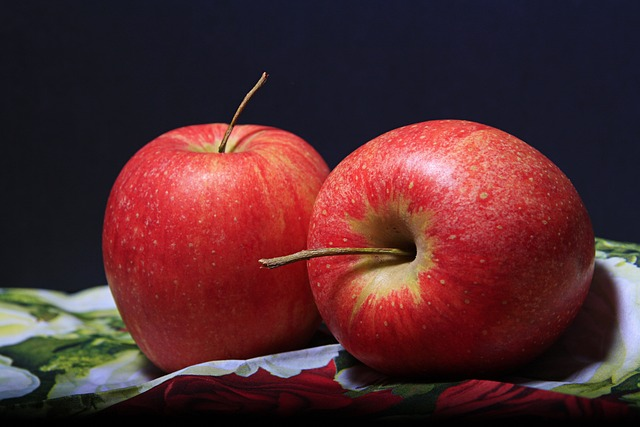

# Color image to B&W Image
`ITU-R BT.601`표준으로 컬러 이미지를 흑백으로 변경해보았습니다.

## 변환 공식
컬러 픽셀을 흑백 픽셀로 변경할 때는 아래 공식을 사용합니다:<br>
```go
> ITU-R BT.601 표준
GRAY = R × 0.299 + G × 0.587 + B × 0.114
```

이 공식은 인간의 시각적 인지 특성을 고려한 가중평균입니다:
- **R (0.299)**: 중간 가중치
- **G (0.587)**: 가장 높은 가중치 - 인간의 눈은 녹색에 가장 민감
- **B (0.114)**: 가장 낮은 가중치 - 인간의 눈은 파란색에 가장 덜 민감

## 변환 결과
| RGB Image      | B&W Image        |
| -------------- | ---------------- |
|  |  |

잘 바뀌는 것을 볼 수 있습니다.<br>
[코드 보러가기](app.py)
